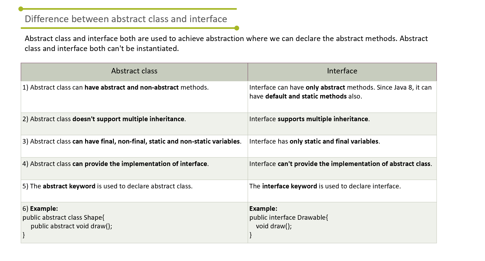

# Abstract Classes & Methods

* Can have both normal and abstract methods
* Abstract methods cannot have body.
* Abstract class CANNOT be initialized
* Abstract methods MUST BE IMPLEMENTED in inherited

```java
public abstract class BaseCharacter implements {
    public abstract void jump();
    public abstract void emote();
    public abstract void die();
    public abstract void attack(int dmg);

    public void talk() {
        System.out.println("HELLO!");
    }
}

public class JEBIBLOX extends BaseCharacter {
    @Override
    public void jump() {
        // implementation
    }

    @Override
    public void emote() {
        // implementation
    }

    @Override
    public void die() {
        // implementation
    }

    @Override
    public void attact() {
        // implementation
    }

    @Override
    public void talk() {
        System.out.println("hehahah!");
    }
}
```

# Interfaces & Implements

* All methods are abstract by default so no need to put abstract.

* Can implement multiple interfaces.

* Static (class) & final variables

```java
interface MyInterface1 {
    public void method1();
}

interface MyInterface2 {
    public void method2();
}

public class myClass implements MyInterface1, MyInterface2 {
    @Override
    public void method1() {
        // implementation
    }

    @Override
    public void method2() {
        // implementation
    }
}
```




# Interesting Case

* Abstract class implementing an interface.
* Child class extending that abstract class


```java
interface Animal {
    void makeSound();
    void move();
}

abstract class Mammal implements Animal {

    // already implemented
    public void move() {
        System.out.println("Walking on land");
    }

    // still abstract but acknowledged the interface
    public abstract void makeSound();
}

class Dog extends Mammal {
    public void makeSound() { // from abstract
        System.out.println("Bark");
    }
}

``

