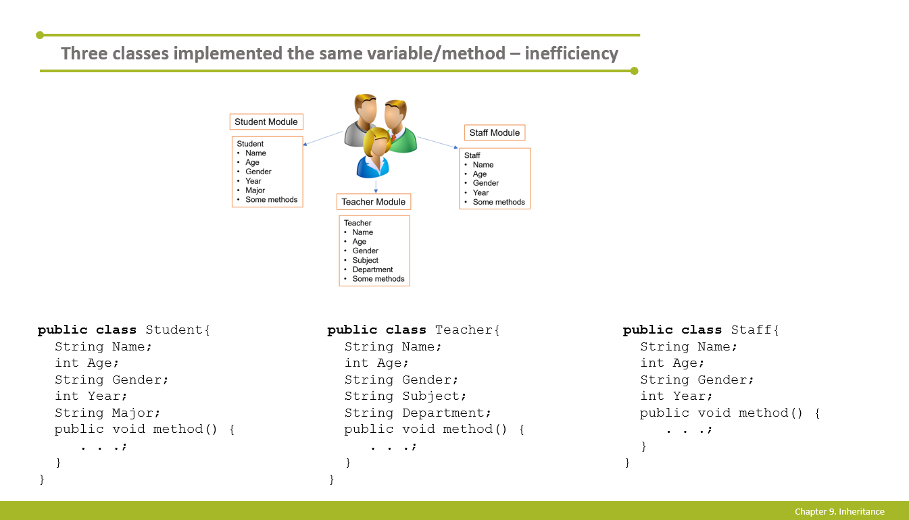
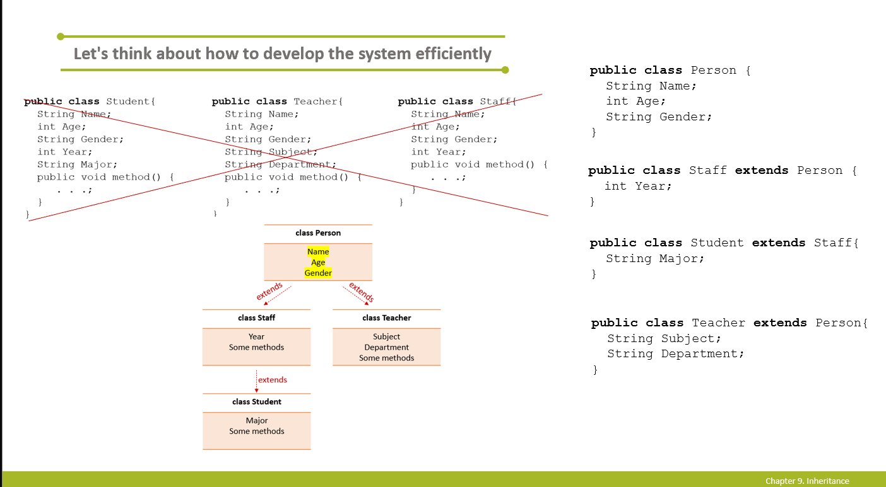
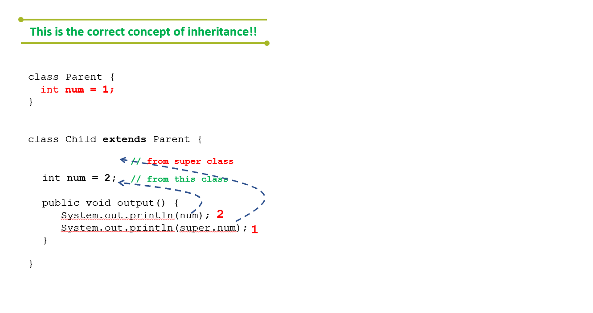
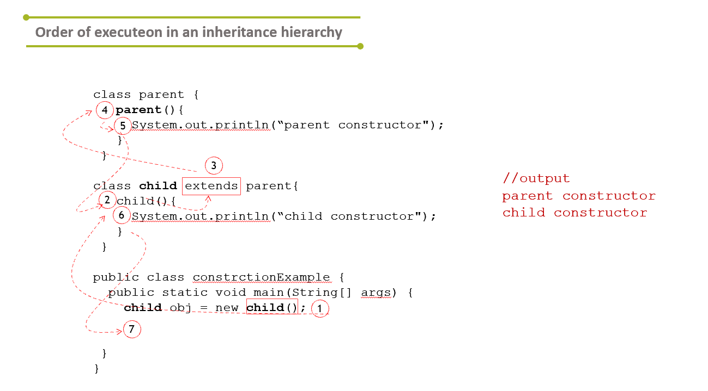

# Chapter 9: Inheritance & Interface (1)
>
> Extends cannot be applied to final classes. Can only inherit one super class

Inheritance is where you want to use methods or attributes from a superclass. You can override them and add on top of them.

How do I develope classes and upgrade existing classes effectively?

* Superclass: The parent class that is being extended
* Subclass: The child class that extends the superclass and inherits its behavior.




Basically, you inherit "super" variables as well so you don't have to recreat them everytime as you can see with the super Person class, each occupation doesn't need to recreate the same name, age, and gender attributes.

## super variables vs this.variables

When you initialize a variable, you have a copy of the super class attributes alongside with the child class `this` attributes.



## default hidden super constructor in child constructor

if you have a constructor or not even written one (there will be default constructor regardless), the first statement is to run the super constructor.



```java
public class child extends parent {

    public child(){
        super(); // by default and you MUST WRITE THIS
        // whatev u want 
    }
}
```

## Override and Overload

* Override is when you want a new implementation of the same method signature. Method signature is a method's name and its parameters.

* Overloading is just having multiple methods with the same name but different parameters. Could serve useful if you need multiple constructors.

```java
public class child extends parent {
    @Override //compiler annoation
    public void OverrideMethod() { // must have EXACT SAME METHOD SIGNATURE
        
    }

    // Overload
    public void hi(int a) {

    }

    public void hi(int a, int b) {

    }
}
```
