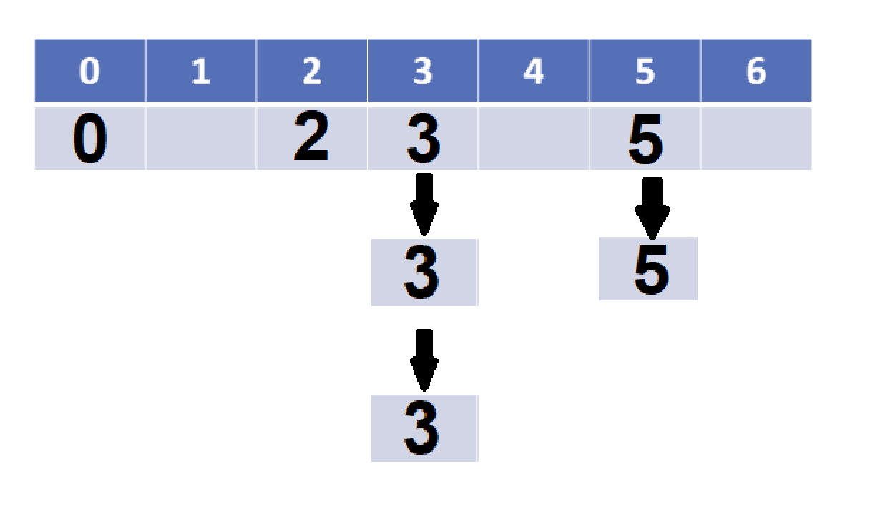

# CP #17

1. With linear hashing, we simply just add each input to the next available index. Since it is total size of 7, we'll just mod 7 with each index.

3 % 7 = 3

{null, null, null, **3**, null, null, null}

0 % 7 = 7

{**0**, null, null, 3, null, null, null}

2 % 7 = 2

{0, null, **2**, 3, null, null, null}

3 % 7 = 3

{0, null, 2, **3**, 3, null, null}

3 % 7 = 3

{0, null, 2, 3, 3, **3**, null}

5 % 7 = 5

{0, null, 2, 3, 3, 3, **5**}

5 % 7 = 5

{0, **5**, 2, 3, 3, 3, 5}

2. The main drawback with linear probing are the hash collisions and clustering.

3. Seperate chaining will help solve . . .

4. Why is the output not ordered? It depends on the mod function and the order in which the sequence is chained.