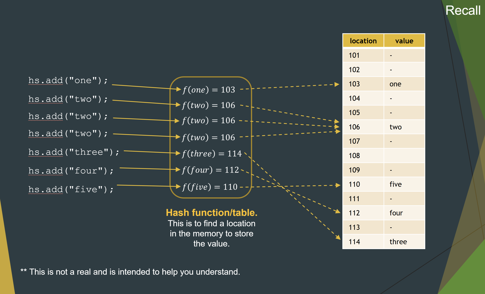
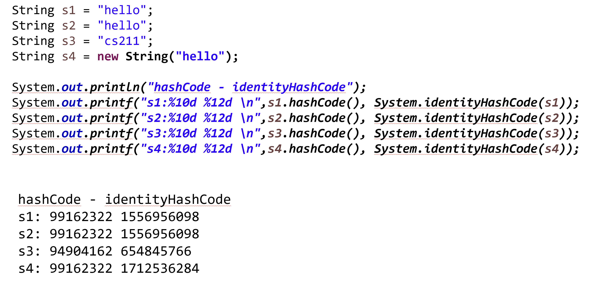
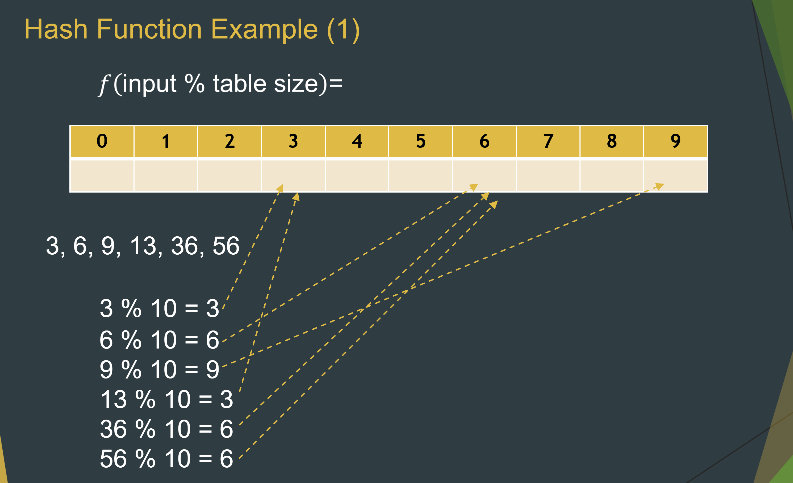
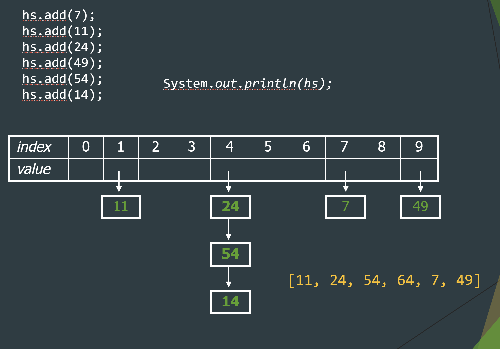
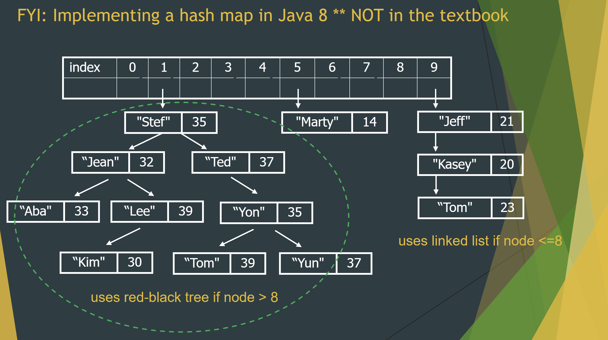
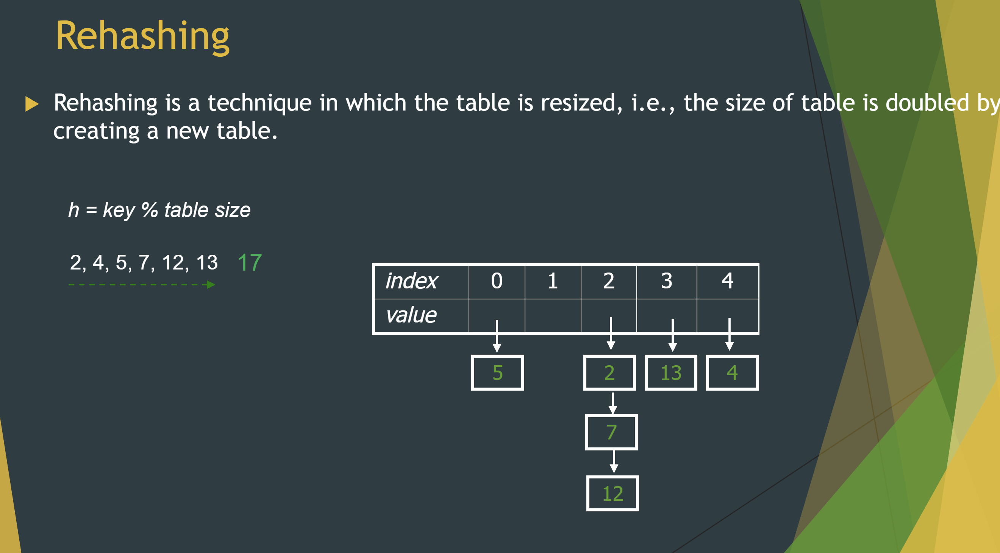
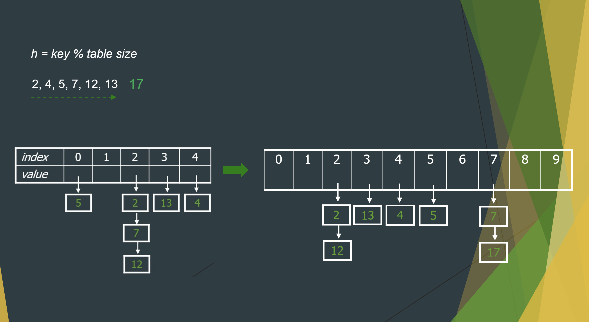

# Hashing Function Review

Recall back in the Java Collection Framework with all of HashSets and HashMaps.
Why do are they called hash and how come they have average constant time.

Basically what happens in theory is that there is a hash functions where you pass through an input that
outputs out a memory location.



```java
String s1="hello";​
String s4= new String ("hello");​

System.out.println(s1==s4); ​       // comparing memory false
System.out.println(s1.equals(s4)); ​// comparing values true

// values hash
System.out.println("s1 hashCode: " + s1.hashCode());​ // s1 hashCode: 96354​
System.out.println("s2 hashCode: " + s2.hashCode()); // s2 hashCode: 96354

// memory hash
System.out.println("s1 hashCode: " + System.identityHashCode(s1)); ​// s1 hashCode: 1556956098​
System.out.println("s4 hashCode: " + System.identityHashCode(s4));​ // s4 hashCode: 1252585652​
```



## How do we store?

​​Silly idea: When client adds value `i`, store it at index `i` in the array.

> Drawback, storing the values 1 and 1,000,000 would mean having an array with 1,000,000 values even if they aren't used.

Unfilled Array: ​​It doesn't really matter what order the elements appear in a set, so long as they can be added and searched quickly.

> Drawback: How efficient to add O(1), contains O(n), remove O(n)? Clearly not O(1) we saw.

Sorted Array: ​Suppose we store the elements in an unfilled array, but​ in sorted order rather than order of insertion.

> Drawback: How efficient to add O(n), contains O(log(n)), remove O(n)? Clearly not O(1) we saw.

Best Idea: A hash function using some modulus operators




## Modulo hash function

To reduce hash collisions, you'll notice that it is best to use a prime number. This is because you will only have a hash function with every multiple of the prime number instead of every factor.


## Hash Collisions

* Linear Probing: Moves to the next available index (wraps if needed).​



* Quadratic Probing: Moves to 1, 4, 9, . . .

* Seperate Chaining + Red Black Tree (self-balancing)


## Rehashing

Double the table size and reiterate the position using the new size.




Hashtable is synchronized, whereas HashMap is not. This makes HashMap better for non-threaded applications, as unsynchronized Objects typically perform better than synchronized ones.​ ​ Hashtable does not allow null keys or values. HashMap allows one null key and any number of null values.

```java
//----------hash table -------------------------​
Hashtable<Integer,String> ht=new Hashtable<Integer,String>();​
ht.put(1,"a");​
ht.put(2,"b");​
ht.put(3,"c");​

// ht.put(null,"n");
System.out.println("-------------Hash table--------------");​
System.out.println("size: "+ht.size());​

for (Map.Entry m:ht.entrySet()) {​
    System.out.println(m.getKey()+" "+m.getValue());​
}​

//----------------hashmap--------------------------------​
HashMap<Integer,String> hm=new HashMap<Integer,String>();​

hm.put(1,"a"); ​
hm.put(2,"b");​
hm.put(3,"c"); ​
hm.put(null,"n");​

System.out.println("-----------Hash map-----------");​
System.out.println("size: "+hm.size());​

for (Map.Entry m:hm.entrySet()) {​
    System.out.println(m.getKey()+" "+m.getValue());​
}​
```