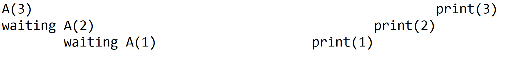
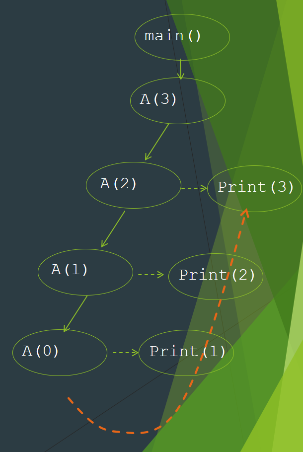

# Recursion Review
>
> You always need a terminating condition.

The idea of calling itself over and over. This makes code very short and elegant while sacrificing time complexity (usually exponential). Iterative code is usually more lengthy and complex but has polynomial time complexity.

We can employ recursion by having a method call itself. Here is an basic example of printing N amount of stars recursively. You can compare it with the iterative method.

```java
public static void printStarsIterative(int n){
  for(int i=0; i<n; i++){
    System.out.println("*");
  }
}


public static void printStarsRecursive(int n){
  System.out.println("*");
   if (n>0) {
      recursivetest(n - 1);
    }
}
```

## Factorial Example

```java
public static long factorial(int n){
  for(int i=n; i>=2; i--){
    n *= i;
  }
  return n;
}

public static long factorialIterative(int n) {
        for (int i = n-1; i >= 2; i--) {
            n *= i;
        }
        return n;
    }

public static long factorialRecursive(int n) {
  if(n==2){ // ignore the n==1 case because it useless to compute N*1.
      return 2;
  }

  return factorial(n-1)*n;
}
```

## Confusing case and order of operations

When you stack statements with recursion, it can be hard to understand the order of they would be run. 
It's best to draw out the every stack.

A(3) will run  AFTER(2) -> -> (3)
  A(2) in turn running AFTER A(1) -> -> prints(2)
    A(1) in turn running  AFTER A(0) -> -> prints (1)
      A(0) which does nothing.  now we go up


```java
public static void main (String[] args) {​
  int x=3;​
  A(x);​ 
  /*
  1
  2
  3
  */
}

public static void A(int n) {​
  if (n>0) {​
    A(n-1);​
    System.out.println(n);​
  }
}​
```



# Palindrome Alg

Continually check the first and last with two pointers and move inwards.

```java

public static boolean palindrome(String s){
  int p0 = 0;
  int p1 = s.length()-1;

  while(p0 <= p1){ // accounts for even & odd lengths.
    if(s.charAt(p0) == s.charAt(p1)){
      p0++;
      p1--;
    } else{
      return false;
    }
  }

  return true;
}

pubilc static boolean palindromeRecursive(String s){

  if(s.length() <= 1) {
    return true;
  }

  if(s.charAt(0) != s.charAt(s.length-1)){
    return false;
  }

  return palindromeRecursive(String.substring(1, s.length()-1))
}

```

# Hanoi Advanced
```java
public class HanoiTower {
  ​
// Java recursive function to solve tower of hanoi puzzle ​

static void towerOfHanoi(int n, char from_rod, char to_rod, char aux_rod) {

if (n == 1) ​{
    System.out.println("Move disk 1 from rod " + from_rod + " to rod " + to_rod);
    return;
}
​
    towerOfHanoi(n - 1, from_rod, aux_rod, to_rod);
    System.out.println("Move disk " + n + " from rod " + from_rod + " to rod " + to_rod);
    ​towerOfHanoi(n - 1, aux_rod, to_rod, from_rod);
}

public static void main(String args[]) {
    int n = 4; // Number of disks ​
    towerOfHanoi(n, 'A', 'C', 'B'); // A, B and C are names of rods ​
  }
  ​
}

```
