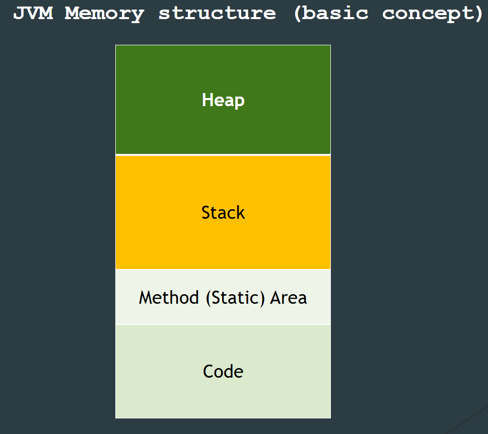
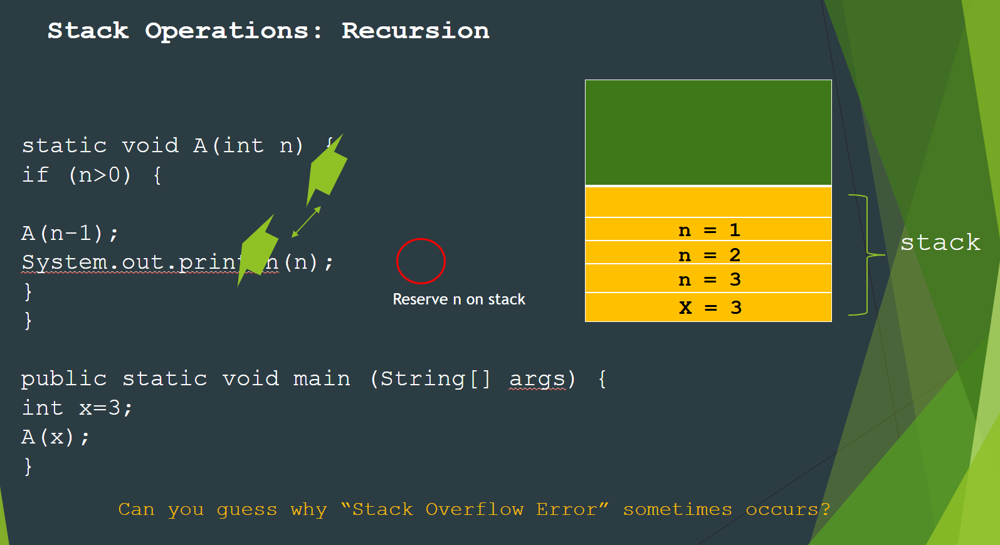

# Stack & Heaps Review

In your JVM memory, you only have a set amount for your operations and variables. You stack will hold all of the temporary variables and the heap. This what it means when stackoverflow error occurs because you run of memory in your stack.

. 

You clear the stack once you finish the function.
