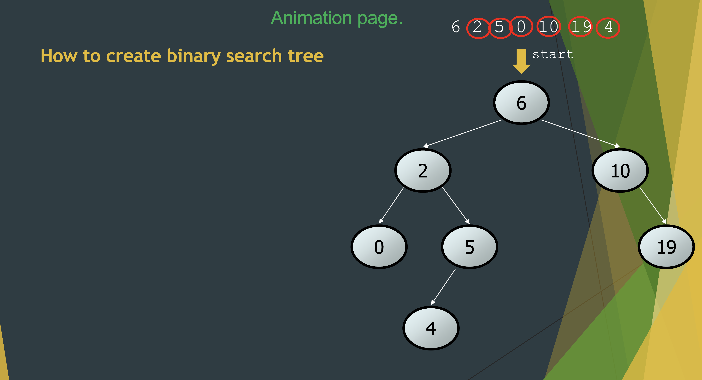
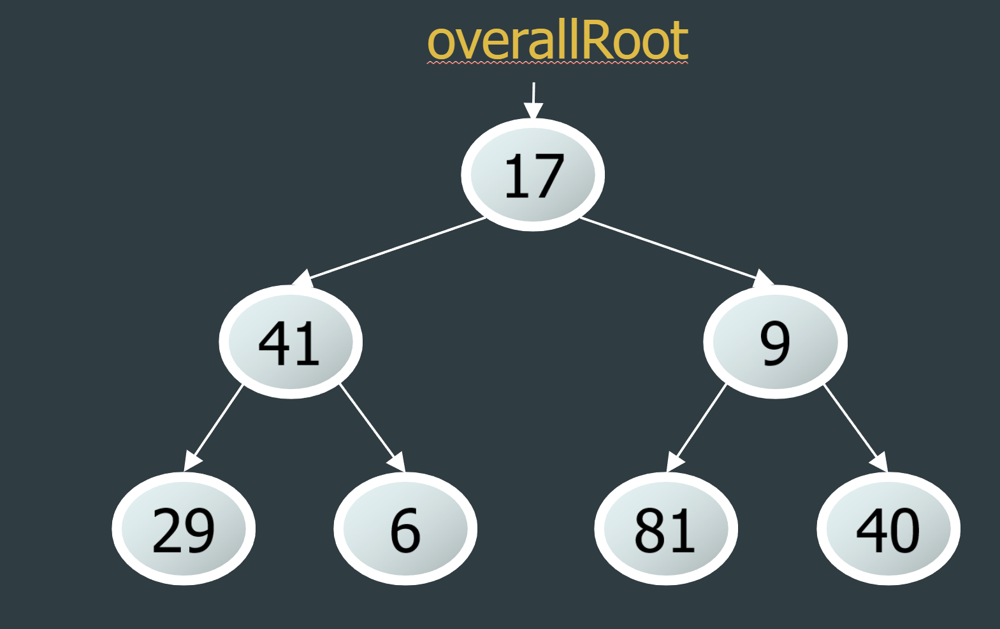
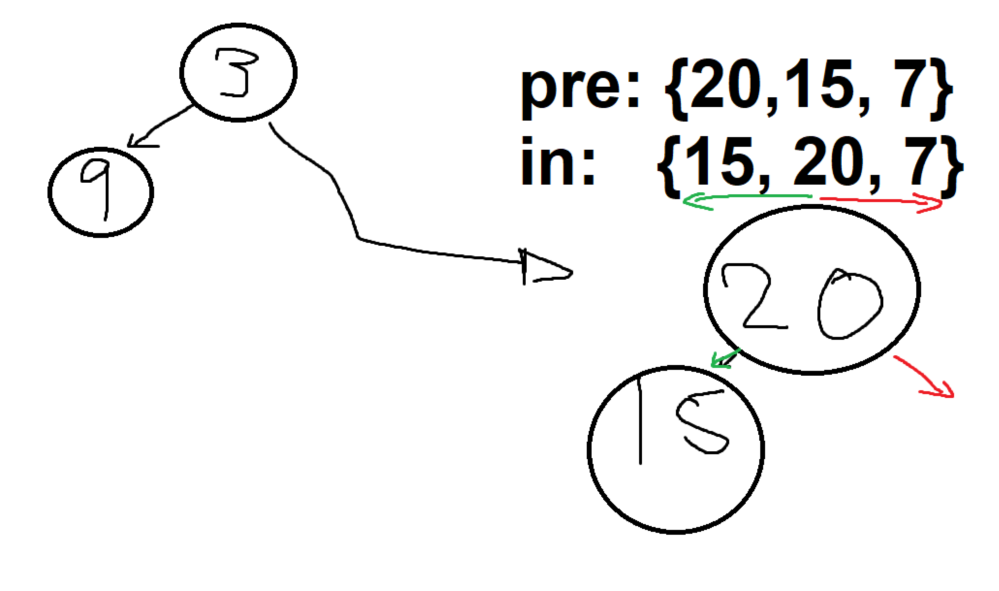
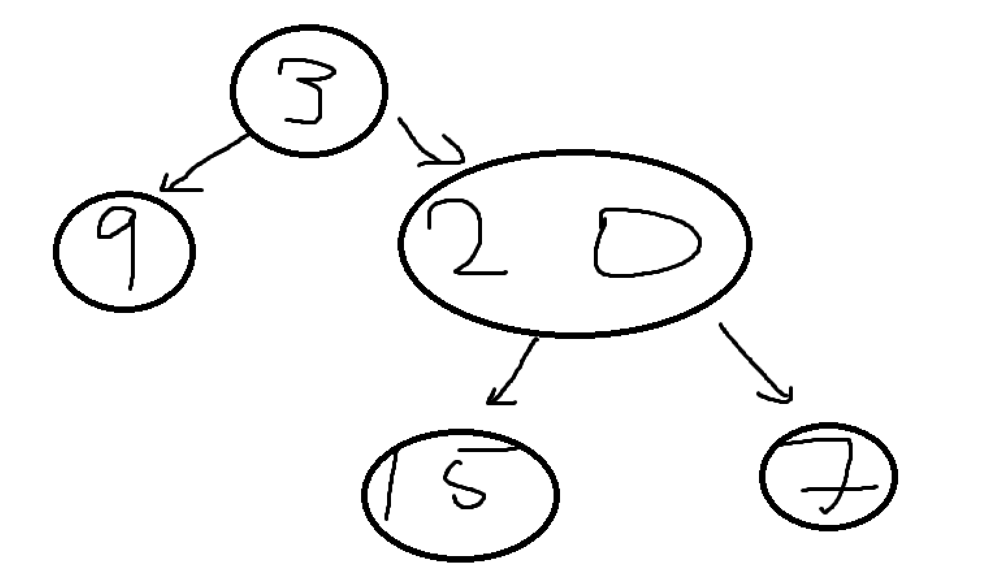
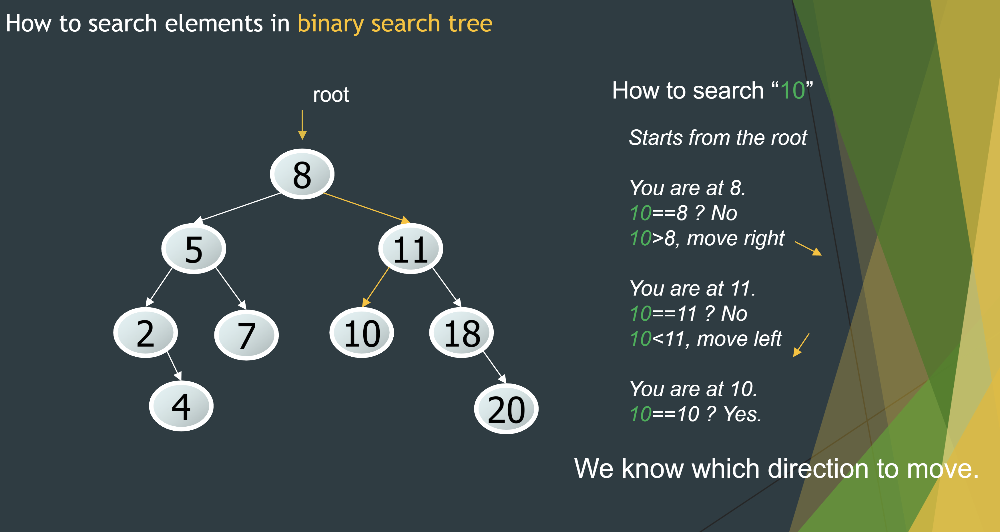

# Binary Search Tree Review

> How can I efficiently search my data? For example, what if I wanted to find all of the females and males?

The answer lies in a new data structure: binary search trees.
A binary search tree is a tree data structure in which root node is **greater ($>$) that to left subtree** and **less than or equal ($\leq$) to right subtree**. ​

The developer can use Binary Search Tree in the following use cases:​

* Binary Search Trees are memory-efficient.​
* Use when the data need to be sorted.​
* Search can be done for a range of values.​
* Height balancing helps to reduce the running time.

## Terminalogy

* node: an object containing a data value and left/right children​
* root: topmost node of a tree​
* leaf: a node that has no children​
* branch: any internal node; neither the root nor a leaf​
* parent: a node that refers to this one​
* child: a node that this node refers to​
* sibling: a node with a common
* subtree: the tree of nodes reachable to the left/right from the current node​
* height: length of the longest path from the root to any node​
* level or depth: length​ of the path from a root ​to a given node​
* full tree: one​ where every branch​ has 2 children

## CREATING ONE



Always start at the root each step and traverse left for less than and right for greater than or equal.

Example:
6 2 5 0 10 19 4

1. Start with 6 as the root.
2. We want to add 2. Start at 6. $2 < 6$ so 2 is on the left of root 6.
3. Start at 6. $5<6$ move to the left. $5\geq2$ so 5 is on the right of branch 2.
4. Start at 6. $0<6$ move to the left. $0<2$ so 0 is on the left of branch 2.
5. Start at 6. $10\geq6$ so move 10 is on the right of root 2.
6. Start at 6. $19\geq6$ move to the right. $19\geq10$ is on the right of branch 10.
7. Start at 6. $4<6$ move to the left. $4\geq2$ move to the right. $4<5$ is on the left of branch 5.
8. Final answer woohoo!

# Traversal

## Easy method

<https://www.youtube.com/watch?v=WLvU5EQVZqY>

* Pre: visited first time
* In: visted 2 times
* Post: visit last time

Create imaginery null nodes and draw starting from the root and following the left and wrapping around.


Example:

* Preorder:  6 2 0 5 4 10 19
* Inorder:   0 2 4 5 6 19 10
* Postorder: 0 4 5 2 19 10 6

## Thorough method




* pre-order: Root-left-right 17 41 29 6 9 81 40​

* in-order: left-Root-right 29 41 6 17 81 9 40​

* post-order: left-right-Root 29 6 41 81 40 9 17

# Constructing a binary tree from traversal

<https://www.youtube.com/watch?v=ihj4IQGZ2zc>

Usually you'll be given only a preorder and inorder.

* Use first 2 entires of preorder for root and first left branch.
* Notice that the the root in the inorder shows us what is on the left of it and on the right of it. Recursively look through each branch repeating this process.

> Shortcut: use left-root-right rule when there are 3.

Human process walkthrough:

Given:

```java
int[] preorder = {3, 9, 20, 15, 7};
int[] inorder = {9, 3, 15, 20, 7};
```

1. Take 3 as the root and have 9 as the left. This will be your main top branch.


2. Let's take a look at the inorder and see what's on the left and on the right of the root 3. If you ever have no left or right, it'll just be a `null`.


3. Now, we're left with the right smaller set of numbers. We have a preorder of `{20, 15, 7}` and an inorder of `{15, 20, 7}`. We now repeat the process in the same way with step 1 and 2. `20` is our new branch root and we know `15` will be on the left of `20` which is also confirmed by our inorder.



4. Final step.  Since there is just one element `7`, it is clear that it should be on the right of 20 from the inorder. Now we just have to combine all of our smaller subtrees and viola.



You can also check your work by working out the preorder and inorder and should get the same result.

Recursive python code implementation:

```python
def buildTree(self, preorder: List[int], oinorder: List[int]) -> TreeNode:
    if not preorder or not inorder:
        return None

    root = TreeNode(preorder[0]) # easy given info
    mid = inorder.index(preorder[0]) # left of the root index and right of the root index
    
    # now we recursively class on the left and on the right elements.
    root.left = self.buildTree(preorder[1:mid + 1], inorder[:mid]) 
    root.right = self.buildTree(preorder[mid + 1:], inorder[mid + 1:])

    return root
```

# Searching

Start at the root and do comparisons, moving left or right, until you reach the final node. MUST BE A BINARY SEARCH TREE.

