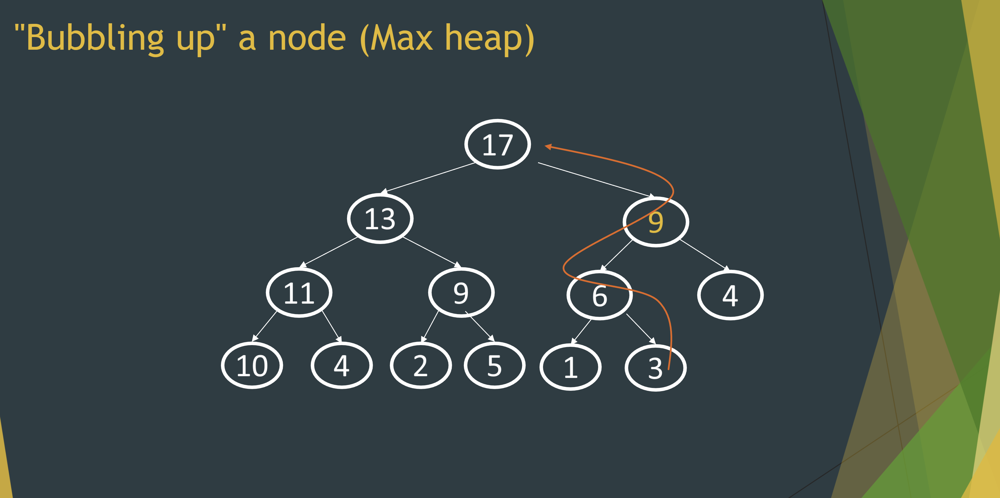
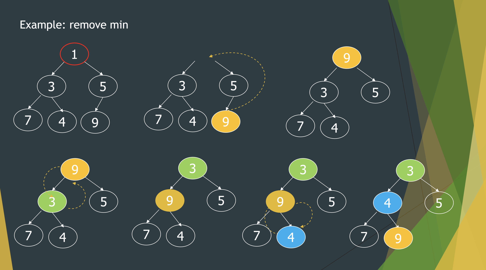

# Heap & Priority Queues
>
> PEEK IS SPELLED WITH TWO E'S

When you go the E.R., you usually don't go in first unless you are about to die. Imagine you are the person that decides that, how do you collect that data have fast peek of the first person in line? The answer lies in Heaps.

Heaps give us a great O(1) peek time, O(logn) for both addition and removal.


## What qualifies as a heap?

A heap my satisfy these criteria:

* Binary tree completeness: Filled from left-to-right. If you had an array that represents an binary tree, there'd be no gaps between the numbers.

* Parent <= Child for min & Parent => Child for max

## How does one create and add numbers to a heap?

Put the node in the right bottom most node to fulfill the binary tree completeness. Compare the parent node and check if it greater or less than it. (for min heap, just check if the added node is smaller than the parent. Vice versa for max heap) Keep "bubbling up" and repeating this process until it is in the correct location.



```java
public void add(int value) {
    heap[size + 1] = value; // add as rightmost leaf (the end)​
    // "bubbling up" as necessary to fix ordering
    int index = size + 1;
    boolean found = false;

    while (!found && hasParent(index)) {
        int parent = parent(index);
        if (heap[index] < heap[parent]) { // 
            swap(heap, index, parent(index));
            index = parent(index);
        } else {
          found = true; // found proper location; stop​
        }
    }
    size++; // you added another object so size += 1.
}
```

## How does one remove numbers (peak) from a heap?

We first remove the first element of the heap. Then we take the further right bottom node and put it to the top.
Afterwards, we repeat this process until it is placed in the correct spot:

For a min heap.

* First check the children of the node. Find which is smaller. This is for when we swap, it'll satisfy the Parent <= Child requirement.

* Check if the current node is smaller than the smallest children node. If it is smaller, then that means it is already in the right spot. Swap with the smallest if not (so either left or right). REPEAT

> min heap


Program Implementaiton Example:

```java
public int remove() {   // precondition: queue is not empty​

    int result = elements[1];      // PEAK RESULT 
    elements[1] = elements[size];​ // last leaf -> root
    size--;​

    int index = 1;    // "bubble down" to fix ordering​
    boolean found = false;​

    while (!found && hasLeftChild(index)) {​
        int left = leftChild(index);​
        int right = rightChild(index);​
        int child = left;​

        if (hasRightChild(index) &&​ elements[right] < element[left]) {​ //checking which child to swap with.
            child = right; ​
        }​

        if (elements[index] > elements[child]) {​ //checking if proper location and swapping if needed.
            swap(elements, index, child);​
            index = child;​
        } else {​
            found = true;  // found proper location; stop​
        }​
    }​
    return result
}

## Peeking 

```java
public int peek() {​
    return elements[1]; // the min/max element is always at array[1]​
}
```
