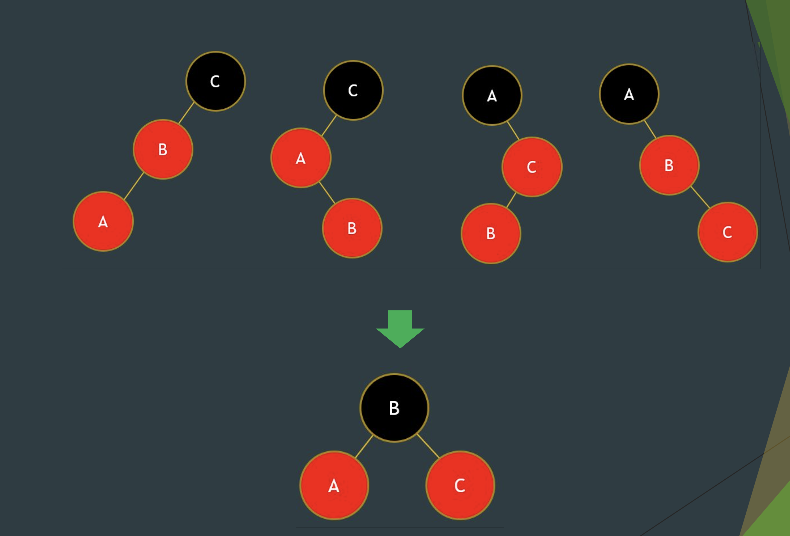
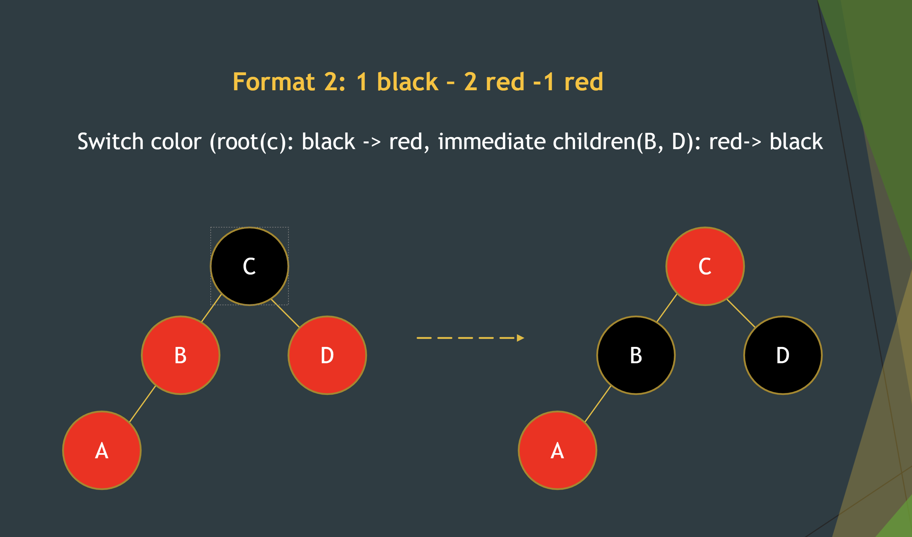
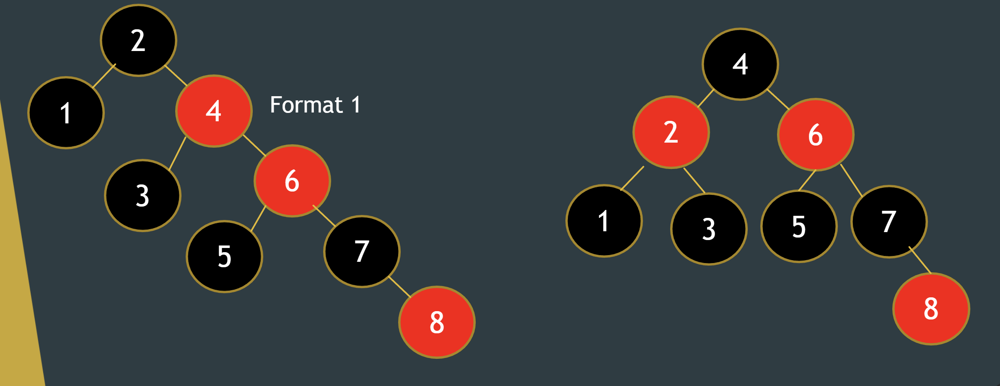
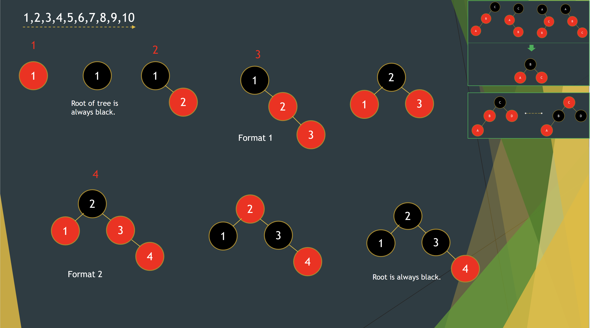
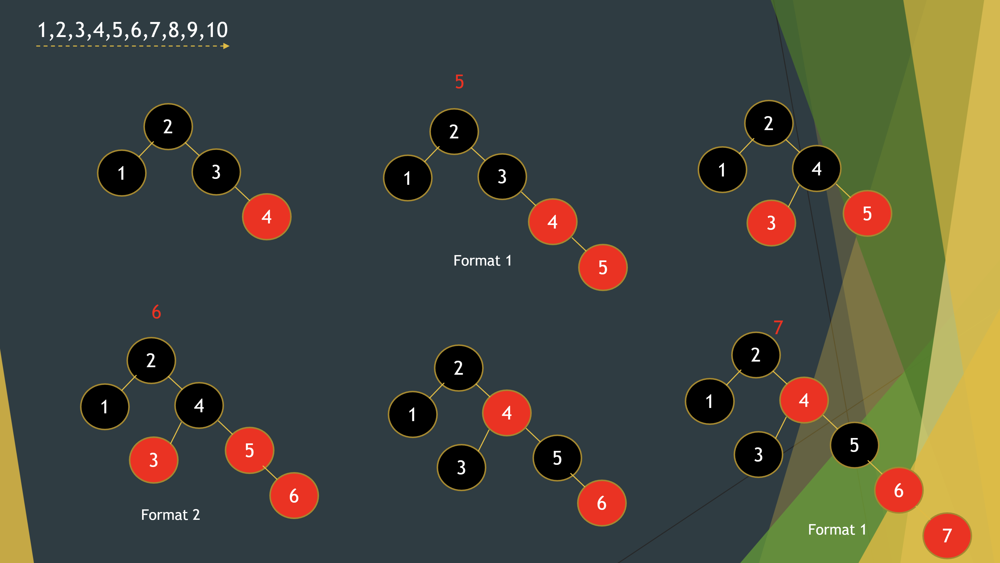
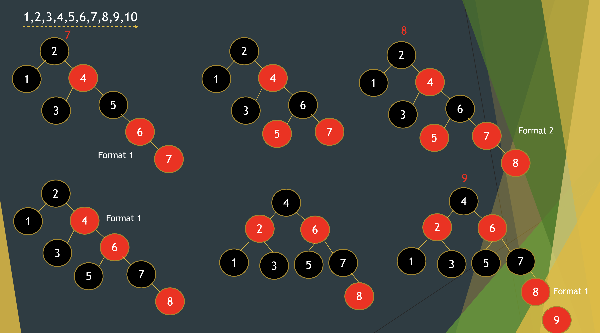
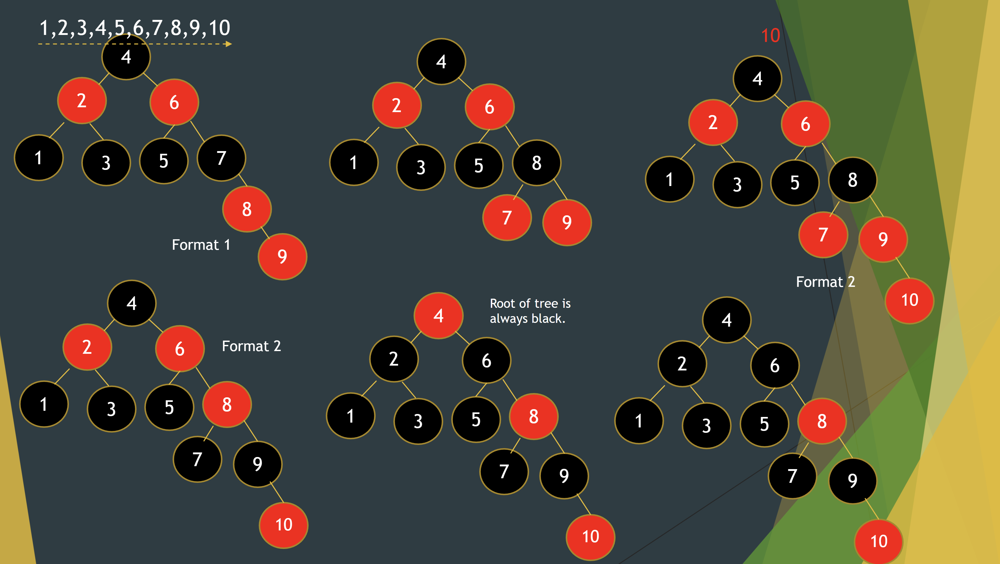

# Red Black Tree Review
>
> Always store an extra bit of info for the color

Recall binary search trees. Binary search trees give great advantages for both searching and adding.
However, the main issue is when the depth of a Binary Tree is not balanced. For example, given a set a numbers `[1, 2, 3, . . . , 10]`, it would simply be a binary tree that goes to the right. This would basically become a LinkedList all over again and would serve no benefit.

> How can we solve this?

The answer is to reduce depth by having a balanced search tree. This guarantees a height of $O(\log(n))$ for $n$ items. A Red Black Tree.

Here are the general rules for a Red Black Tree:

* A node is either red or black.
* The root and leaves (NIL) are black.
* If a node is red, then its children are black (no adjacent reds).
* All paths from a node to its NIL descendants contain the same number of black nodes.

Format 1:
For any 3 nodes, just take the midpoint and make it the branch and make the other 2 leaf nodes.

Format 2:
3 node + 1 red.  

Process:

To be honest, the rules don't really make too much sense but the process should clear a lot up.

1. Everytime you add a new number/node, make it red initially and add it like how you would in a binary search tree. Afterwards, use the rules.
2. Is it a root? -> Root should be black
3. Is it adjacent to another red? -> Format 1 or Format 2. -> Root should be BLACK.
4. Repeat with each new node.

EXCEPTION CASE (3 nodes connected to one):

So 2,4,6 are format 1 so we clearly choose 4 as the middle and make 2 and 5 the branching nodes.
This leaves us with the black 3 node. Keep it the same color but just add it how you would the same way as binary search tree.

# EXAMPLE

