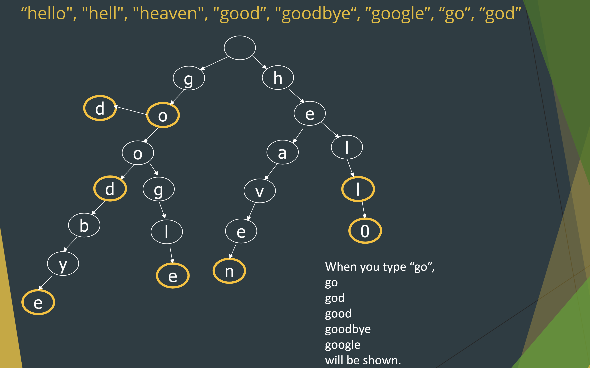
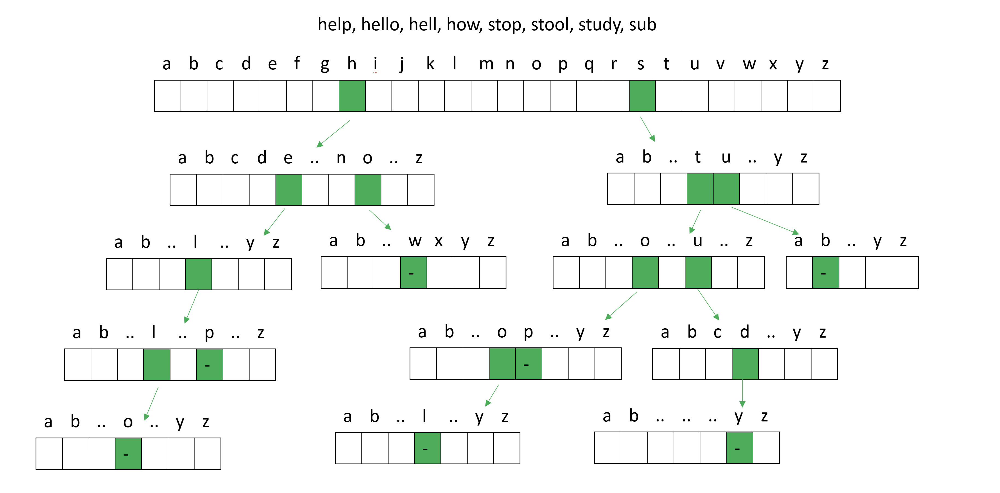

# Trie/Prefix Tree Review

Do you ever wonder how those autocomplete text options form when you are texting?
Or how to store a dictionary?

One could just store each word individually in a massive array. However, really quickly, you'll see that it scales massively and
retrieval is horrible $O(n)$. You wouldn't want the program to buffer for absurd amounts of time. What we need is a data structure
that gives us $O(\log(n))$ lookup time. The answer lies in the Trie Tree.

## What is a Trie Tree?

FORMAL DEFINATION: A Trie is an ordered tree data structure that is used to store a dynamic set or associative array.

DEFINATION: A trie tree is an ordered tree that can have any amount of children nodes. This means no direction such as left or right node.

### Usages

* Fixed dictionary and want to look up quickly.​
* Require less storage for a large dictionary.​
* Matching sentences during string matching.

## Process for dictionaries

The root will always be an empty because you need it to link to 26 characters of the alphabet for the first character of a word. After that, for each children node, they will each have 26 possible character options and have more children nodes for each added character of a word.



> In the second photo, you can see all of 26 possible nodes.

# Code Implementation

```java
class tNode{​
    public boolean isEnd;​
    public tNode[] child = new tNode[26];​ // for 26 chars in the alphabet

    public static void addWord(tNode root, String word){​
        for (int j = 0; j < word.length(); j++) {​ // for each letter of the word
            char c = word.charAt(j); ​// character at each index

            if(root.child[c-'a']!=null) {​  // c-'a' makes it so child[0] is a and child[25] is z.
                if(word.length()-1 == j) { ​
                    root.child[c-'a'].isEnd = true;​
                }​
                root = root.child[c-'a'];​
            }​ else {​
                tNode trie = new tNode();​ //add child node and iteratively repeat the process, making the child the new "root".
                trie.isEnd = (word.length()-1 == j ? true:false);​
                root.child[c-'a'] = trie;​ //add the character for the child node.
                root = root.child[c-'a'];​
            }​
        } ​
    }​
    
    public static boolean searchWord(tNode root, String word) {
        boolean isFound = true;
        for (int i = 0; i < word.length(); i++) {
            char c = word.charAt(i);

            if (root.child[c - 'a'] != null) { //check through the tree if there exists a child character node.
                if (word.length() - 1 != i) { // if isn't the last character of the word, traverse further.
                    root = root.child[c - 'a'];
                } else if (!root.child[c - 'a'].isEnd) { // if in trie tree, it stops before the entire word is traversed/lookedup.
                    isFound = false;
                } ​ 
                // if nothing goes wrong then yay.
            } else { // edge case if even the character exists.
                isFound = false;
                break;
            }
        }
        return isFound;
    }

    public static void printWord(tNode root, String toPrint) {​
        if(root==null){​ // edge case to check if letter exists in the trie
            return;​
        }​

        if(root.isEnd){​
            System.out.println(toPrint);​
        }   ​

        for (int i = 0; i < root.child.length; i++) {​ // we are printing ALL POSSIBLE PATHS. root.child.length is always 26.
            tNode t = root.child[i];​

            if(t!=null){​ // pass through next node and continually print.
                printWord(t, toPrint + (char)('a' + i ));​ // recursively add one character at a time until we reach the isEnd.
            }       ​
        }   ​
    }​

    public static void prefixWord(tNode root, String preFix) { ​// basically printword but if i want to start with a prefix.
        tNode t= new tNode(); ​
        t=root;​
        System.out.println("prefix: " + preFix); ​

        for (int i = 0; i < preFix.length(); i++) {​ // basically traverse to the position in the trie at the end of the prefix. so ignore the past and only the prefix subtree only.
            char c = preFix.charAt(i);​
            t = t.child[c-'a']; ​// arrive at the spot.
        } ​
        printWord(t, preFix); ​
    }​
    
} ​
```

```java

public class Trie211 {​

    public static void main(String[] args) {​
        tNode root = new tNode();​
        // add words​
        addWord(root, "help");​

        // print all the words​
        System.out.println("List of words");​
        printWord(root, "");​ // every single word since we start at empty root.
        System.out.println();​

        //ask user for a prefix​
        String prefix= "hel";​
        prefixWord(root, prefix);​ // print every word starting with "hel".

        // test if the word is in the tree​
        System.out.println(searchWord(root, "has"));​
    }
}​
```

# Compressed & Radix Tree

 When you are a creating a trie, similiarly to a binary tree, you face issues with height. Moving forward, you might see that you can reduce the height by compressing combinations of words.

