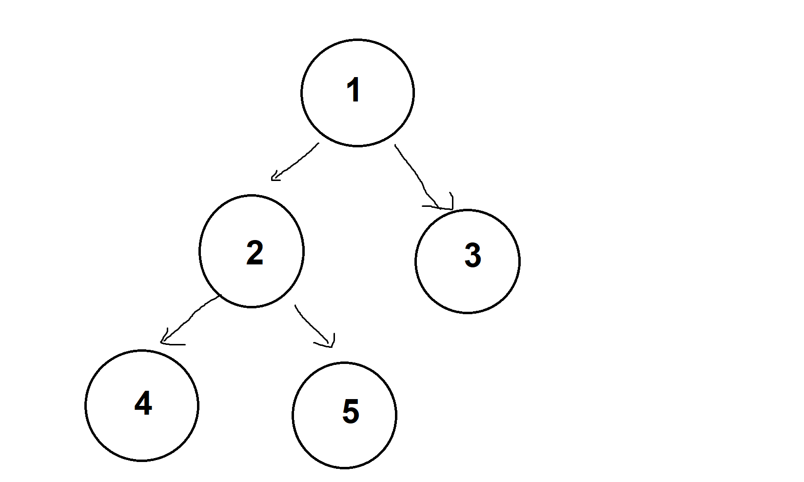
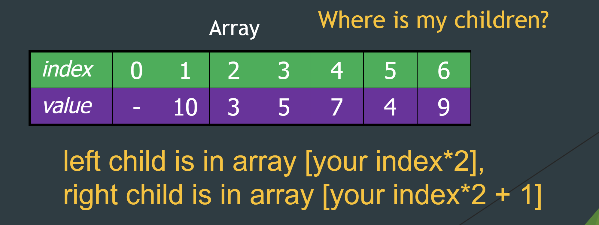

# Representing a Tree using array/arraylist

Imagine you want to represent a binary tree using an array. How could one approach this?

An easy implementaiton is to continually fill each height with each index with empty spots as `null`. For example, let us have an array `int[] a = {1,2,3,4,5}` represent a min heap.

Here it is easy to see a visual representation. An important thing is to be able find their parent and child nodes from purely numerical index. With some patterns and math, we can see that each height goes in a powers of 2: `1, 2, 4, ..., 2^h`.

* Using this intuition, you can find its parent using integer division `index/2`.
* left child is in array `your index*2`, ​
* right child is in array `your index*2 + 1`

`your index * 2` allows us to find the base node from the parent.
