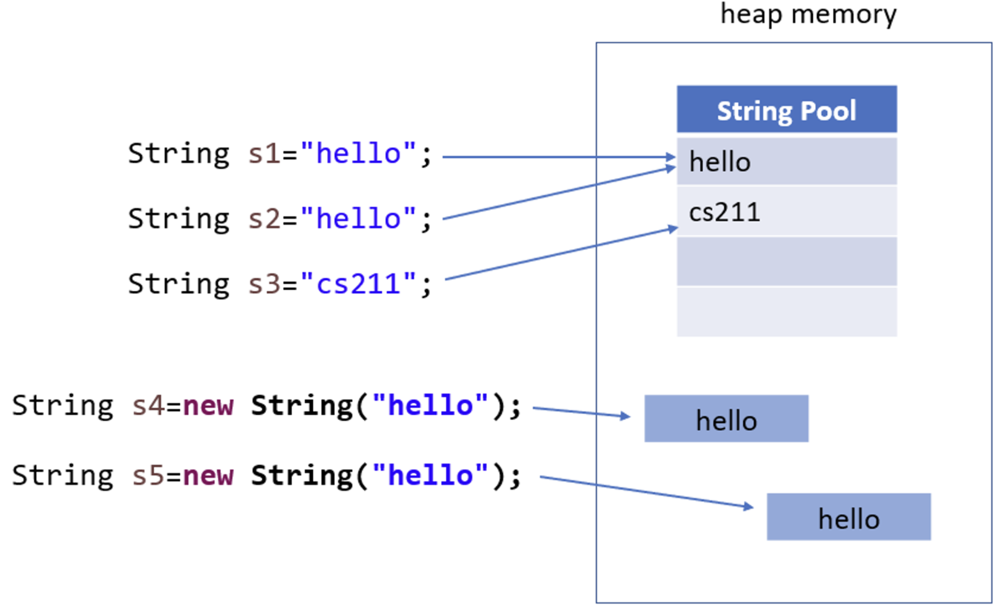

# `==` versus `.equal` Review

* `==` compares values and for strings the memory values
* `.equals` compares actual values

```java
String s1="hello";​
String s4= new String ("hello");​

System.out.println(s1==s4); ​ // false
System.out.println(s1.equals(s4)); ​// true

System.out.println("s1 hashCode: " + System.identityHashCode(s1)); ​// s1 hashCode: 1556956098​
System.out.println("s4 hashCode: " + System.identityHashCode(s4));​ // s4 hashCode: 1252585652
``` 

