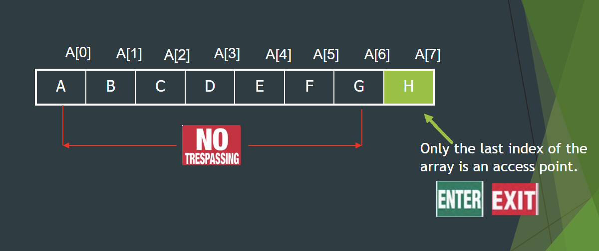

# Stacks & Queues Review

* Stacks are LIFO like plates.
* Queres are FIFO like lines.

## Stacks

Head Index is **starts at 1** when using search.




```java
Stack<Integer> myStack = new Stack<>();

myStack.push(1);
myStack.push(4);
myStack.push(9);

System.out.println(myStack); // Stacks have a toString(). [1, 4, 9]
myStack.pop(); // REMOVES 9 and returns 9. myStack = [1, 4]

System.out.println(myStack.peak()); // returns 4
System.out.println(myStack.pop()); // REMOVES 4 and returns 4.

System.out.println(myStack); // [1]
System.out.println(myStack.isEmpty()); // false

System.out.println(myStack.search(1)); // 1
System.out.println(myStack.search(9)); // -1 NOT FOUND
```


| Methods                | Return  |
| ---------------------- | ------- |
| `empty()`      | `boolean`   |
| `peek()`      | `E` |
| `pop()`      | `E` |
| `push(E item)`     | `E` |
| `search(Object o)`     | `int` |

## Queue

Can be implemented using Arrays or LinkedLists. You can't search.


```java
Queue<String> q = new LinkedList<>();

q.add("A");
q.add("B");
System.out.println(q); // [A, B]

System.out.printlnt(q.remove()); // A
System.out.println(q.peek()); // B
```

| Methods                | Return  |
| ---------------------- | ------- |
| `add(E e)`      | `boolean`   |
| `peek()`      | `E` |
| `remove(E item)`     | `E` |
| `poll()`      | `E` |
| `offer(Object o)`     | `boolean` |
| `elememt()`     | `E` |