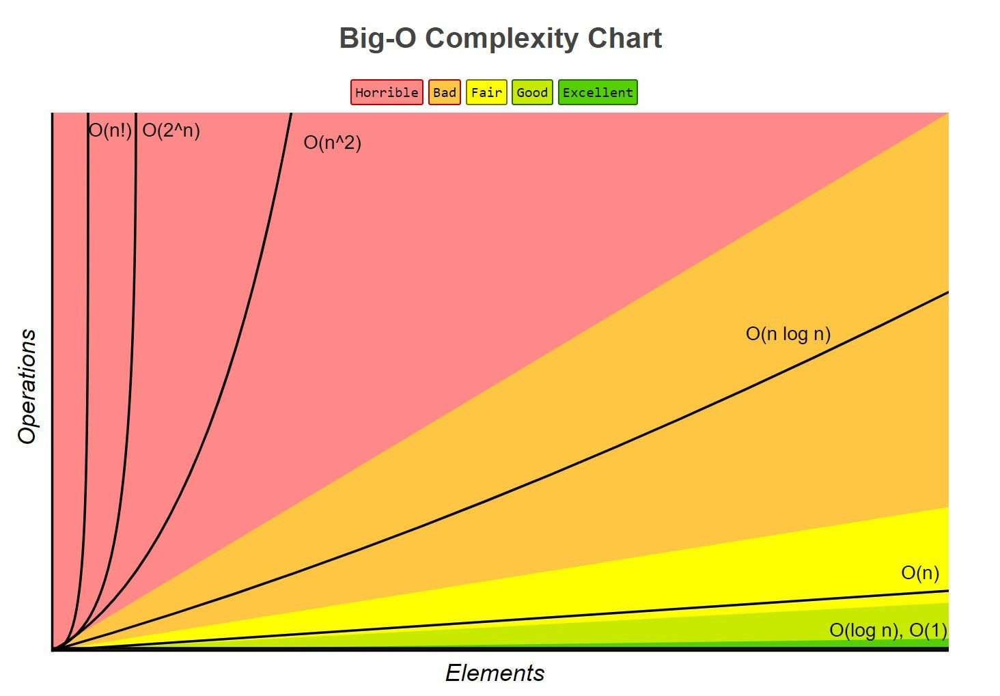

# Time & Space Complexity and Big O Notation Review

## Disclaimers

>Big O notation may give great insight on what algorithms to pick and additionally pinpointing bottlenecks in your code. However, Big O Notation only gives asymptotic behavior and thus does not bring into the full picture of initial time (removing coefficients and constants) and short term behavior. For example, HashMaps have an exceptional O(1) time complexity but has a larger constant start up cost. Hence, for smaller datasets, it may be better to use a faster datastructure for that smaller use case only.

## Big O Notation
When we want to compare algorithms with one another, what criteria should we use? The answer is Big O notation. Big O notation in math is the general asymptopic behavior of a function. It can be used to understand the general behavior of limits and series. This analysis of seeing how ***functions behave over long periods of time*** also extends to algorithms.


We can classify each statement and algorithm by the following general equations:

* $O(1)$:        Constant Time
* $O(\log(n))$:  Logarithmic Time
* $O(n)$:        Linear Time
* $O(n\log(n))$: Linearithmic Time
* $O(n^c)$:      Polynomial Time
* $O(c^n)$:      Exponential Time
* $O(n!)$:       Factorial Time



The process of classifying an algorithm is to take the **largest, worse case time complexity**. After you have the largest time complexity, chop off constants and coefficients.

> Here is an example:

```java
void example1(int n){
    int count = 0; // O(1)
    int i ; // O(1)
    for (int i = 0; i < n ; i++){ // O(n+1) 
        count++; // O(n) happens everytime with the for loop
    }
}
// Total Execution Time: 
// 1+1+(n+1)+n = 2n + 3 = O(n)
```

# Sorting alg stuff
